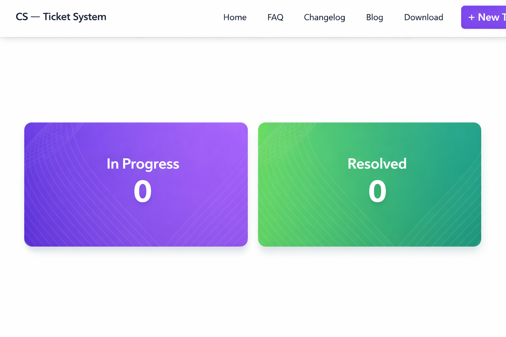
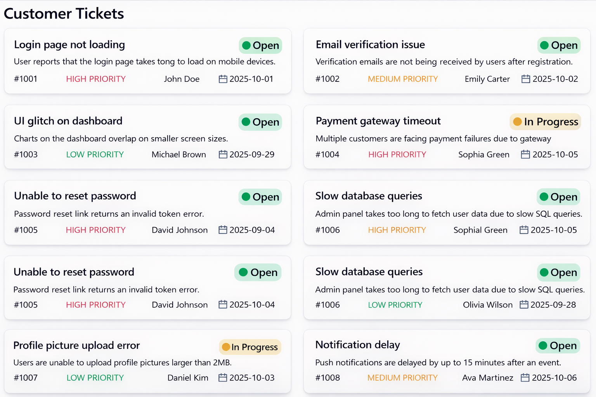
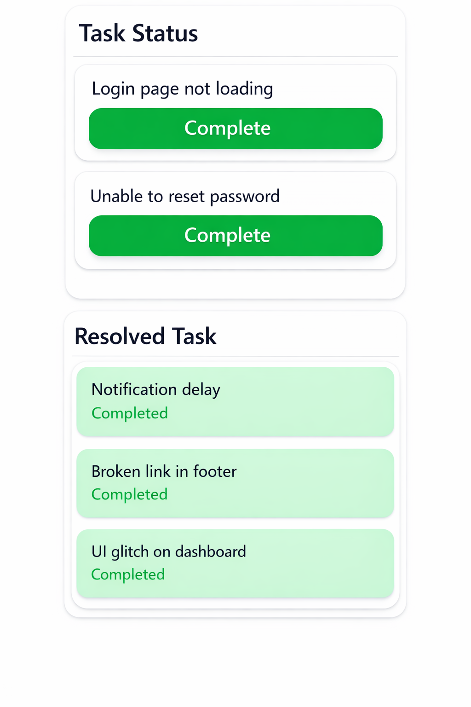

# 🎫 Customer Support Zone – React Ticket System

A **modern React-based Customer Support Ticket System** that allows users to manage customer issues efficiently.  
Users can track ticket progress, monitor statistics, and mark issues as resolved.

The interface follows a **clean Figma-inspired design** and includes enhanced features like **toast notifications, responsive layout, and dynamic ticket status tracking**.

---

# 🚀 Live Preview

🔗 **Live Site:** https://customer-support-zone-p.netlify.app

---

# 📸 Project Screenshots

## 📸 Screenshots

### Dashboard


### Customer Tickets


### Task Status


---
> 📁 Store all screenshots inside a folder named **screenshots** in the root of your project.

Example folder structure:

```
project-root
│
├── screenshots
│   ├── home.png
│   ├── status.png
│   └── mobile.png
│
├── src
├── public
└── README.md
```

---

# ✨ Key Features

✔ Fully **Responsive Design** (Mobile, Tablet, Desktop)  
✔ Customer **Ticket Card System**  
✔ Track **In-Progress Tickets**  
✔ Mark tickets as **Resolved**  
✔ Dynamic **Ticket Statistics Banner**  
✔ Beautiful **Toast Notifications** using React Toastify  
✔ JSON-based ticket management  
✔ Clean and scalable **Component Architecture**  
✔ Easy-to-understand project structure

---

# 🧩 Project Structure

```
src
│
├── components
│   ├── Banner.jsx
│   ├── TicketCard.jsx
│   ├── TicketList.jsx
│
├── data
│   └── tickets.json
│
├── pages
│   └── Home.jsx
│
├── App.jsx
└── main.jsx
```

---

# 🛠 Technologies Used

| Technology       | Purpose                     |
| ---------------- | --------------------------- |
| React.js         | Frontend Framework          |
| Vite             | Fast Build Tool             |
| Tailwind CSS     | Styling & Responsive Design |
| React Toastify   | Notification System         |
| JavaScript (ES6) | Application Logic           |
| HTML5            | Structure                   |
| CSS3             | Styling                     |

---

# 📂 Ticket Data Structure (JSON)

Each ticket object contains the following properties:

```json
{
  "id": 1,
  "customer_name": "John Doe",
  "issue": "Unable to login to account",
  "priority": "High",
  "status": "In Progress"
}
```

---

# ⚙ Installation & Setup

Follow these steps to run the project locally.

### 1️⃣ Clone the repository

```bash
git clone https://github.com/yourusername/customer-support-zone.git
```

### 2️⃣ Navigate to the project folder

```bash
cd customer-support-zone
```

### 3️⃣ Install dependencies

```bash
npm install
```

### 4️⃣ Run the development server

```bash
npm run dev
```

The project will run at:

```
http://localhost:5173
```

---

# 🎯 Future Improvements

- 🔐 Authentication system
- 🗂 Ticket filtering & search
- 📊 Advanced analytics dashboard
- 📨 Email notifications for ticket updates
- 💾 Backend database integration
  ---
## 👨‍💻 Author


**MD Parvez Hasan**  
MERN Stack Developer

- 📧 Email: parvezyesrat17032024@gmail.com 
- 📱 Phone: +8801876097788 
- 💼 LinkedIn: www.linkedin.com/in/md-parvez-hasan-967729344  
- 🐙 GitHub:https://github.com/parety308
---

# ⭐ Support

If you like this project, please **give it a star ⭐ on GitHub**.  
It helps others discover the project.